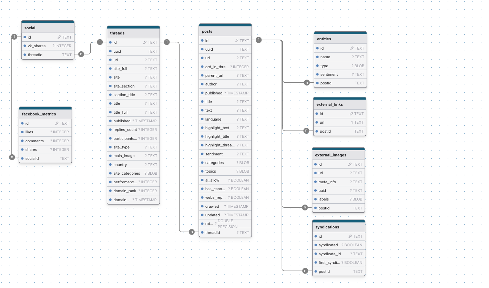

# API NODE

- [API NODE](#api-node)
  - [Introduction](#introduction)
  - [Database type](#database-type)
  - [Table structure](#table-structure)
    - [threads](#threads)
      - [Indexes](#indexes)
    - [social](#social)
      - [Indexes](#indexes-1)
    - [facebook\_metrics](#facebook_metrics)
      - [Indexes](#indexes-2)
    - [posts](#posts)
      - [Indexes](#indexes-3)
    - [entities](#entities)
    - [external\_links](#external_links)
    - [external\_images](#external_images)
    - [syndications](#syndications)
      - [Indexes](#indexes-4)
  - [Relationships](#relationships)
  - [Database Diagram](#database-diagram)

## Introduction

This document represents database schema diagram generated from [drawdb app](https://www.drawdb.app) reflecting the schema described on [webz.io](https://docs.webz.io/reference/output).

## Database type

- **Database system:** PostgreSQL

## Table structure

### threads

| Name        | Type          | Settings                      | References                    | Note                           |
|-------------|---------------|-------------------------------|-------------------------------|--------------------------------|
| **id** | TEXT | 🔑 PK, not null  |  | |
| **uuid** | TEXT | not null  |  | |
| **url** | TEXT | not null  |  | |
| **site_full** | TEXT | not null  |  | |
| **site** | TEXT | not null  |  | |
| **site_section** | TEXT | not null  |  | |
| **section_title** | TEXT | not null  |  | |
| **title** | TEXT | not null  |  | |
| **title_full** | TEXT | not null  |  | |
| **published** | TIMESTAMP | not null  |  | |
| **replies_count** | INTEGER | not null  |  | |
| **participants_count** | INTEGER | not null  |  | |
| **site_type** | TEXT | not null  |  | |
| **main_image** | TEXT | not null  |  | |
| **country** | TEXT | not null  |  | |
| **site_categories** | BLOB | not null  |  | |
| **performance_score** | INTEGER | not null  |  | |
| **domain_rank** | INTEGER | not null  |  | |
| **domain_rank_updated** | TIMESTAMP | not null  |  | |

#### Indexes

| Name | Unique | Fields |
|------|--------|--------|
| threads_uuid_key | ✅ | uuid |

### social

| Name        | Type          | Settings                      | References                    | Note                           |
|-------------|---------------|-------------------------------|-------------------------------|--------------------------------|
| **id** | TEXT | 🔑 PK, not null  |  | |
| **vk_shares** | INTEGER | not null  |  | |
| **threadId** | TEXT | not null  | social_threadId_fk | |

#### Indexes

| Name | Unique | Fields |
|------|--------|--------|
| social_threadId_key | ✅ | threadId |

### facebook_metrics

| Name        | Type          | Settings                      | References                    | Note                           |
|-------------|---------------|-------------------------------|-------------------------------|--------------------------------|
| **id** | TEXT | 🔑 PK, not null  |  | |
| **likes** | INTEGER | not null  |  | |
| **comments** | INTEGER | not null  |  | |
| **shares** | INTEGER | not null  |  | |
| **socialId** | TEXT | not null  | facebook_metrics_socialId_fk | |

#### Indexes

| Name | Unique | Fields |
|------|--------|--------|
| facebook_metrics_socialId_key | ✅ | socialId |

### posts

| Name        | Type          | Settings                      | References                    | Note                           |
|-------------|---------------|-------------------------------|-------------------------------|--------------------------------|
| **id** | TEXT | 🔑 PK, not null  |  | |
| **uuid** | TEXT | not null  |  | |
| **url** | TEXT | not null  |  | |
| **ord_in_thread** | INTEGER | not null  |  | |
| **parent_url** | TEXT | not null  |  | |
| **author** | TEXT | not null  |  | |
| **published** | TIMESTAMP | not null  |  | |
| **title** | TEXT | not null  |  | |
| **text** | TEXT | not null  |  | |
| **language** | TEXT | not null  |  | |
| **highlight_text** | TEXT | not null  |  | |
| **highlight_title** | TEXT | not null  |  | |
| **highlight_thread_title** | TEXT | not null  |  | |
| **sentiment** | TEXT | not null  |  | |
| **categories** | BLOB | not null  |  | |
| **topics** | BLOB | not null  |  | |
| **ai_allow** | BOOLEAN | not null  |  | |
| **has_canonical** | BOOLEAN | not null  |  | |
| **webz_reporter** | BOOLEAN | not null  |  | |
| **crawled** | TIMESTAMP | not null  |  | |
| **updated** | TIMESTAMP | not null  |  | |
| **rating** | DOUBLE PRECISION | not null  |  | |
| **threadId** | TEXT | not null  | posts_threadId_fk | |

#### Indexes

| Name | Unique | Fields |
|------|--------|--------|
| posts_uuid_key | ✅ | uuid |

### entities

| Name        | Type          | Settings                      | References                    | Note                           |
|-------------|---------------|-------------------------------|-------------------------------|--------------------------------|
| **id** | TEXT | 🔑 PK, not null  |  | |
| **name** | TEXT | not null  |  | |
| **type** | BLOB | not null  |  | |
| **sentiment** | TEXT | not null  |  | |
| **postId** | TEXT | not null  | entities_postId_fk | |

### external_links

| Name        | Type          | Settings                      | References                    | Note                           |
|-------------|---------------|-------------------------------|-------------------------------|--------------------------------|
| **id** | TEXT | 🔑 PK, not null  |  | |
| **url** | TEXT | not null  |  | |
| **postId** | TEXT | not null  | external_links_postId_fk | |

### external_images

| Name        | Type          | Settings                      | References                    | Note                           |
|-------------|---------------|-------------------------------|-------------------------------|--------------------------------|
| **id** | TEXT | 🔑 PK, not null  |  | |
| **url** | TEXT | not null  |  | |
| **meta_info** | TEXT | not null  |  | |
| **uuid** | TEXT | not null  |  | |
| **labels** | BLOB | not null  |  | |
| **postId** | TEXT | not null  | external_images_postId_fk | |

### syndications

| Name        | Type          | Settings                      | References                    | Note                           |
|-------------|---------------|-------------------------------|-------------------------------|--------------------------------|
| **id** | TEXT | 🔑 PK, not null  |  | |
| **syndicated** | BOOLEAN | not null  |  | |
| **syndicate_id** | TEXT | not null  |  | |
| **postId** | TEXT | not null  | syndications_postId_fk | |

#### Indexes

| Name | Unique | Fields |
|------|--------|--------|
| syndications_postId_key | ✅ | postId |

## Relationships

- **social to threads**: many_to_one
- **facebook_metrics to social**: many_to_one
- **posts to threads**: many_to_one
- **entities to posts**: many_to_one
- **external_links to posts**: many_to_one
- **external_images to posts**: many_to_one
- **syndications to posts**: many_to_one

## Database Diagram

